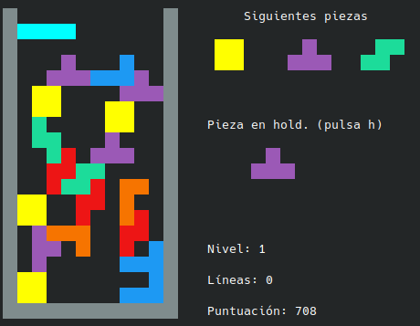

# 🧩 Ctris

**Ctris** es una implementación en C del clásico **Tetris**, usando programación estructurada con técnicas de orientación a objetos simuladas (con `structs` y `vtables`).
Está hecho para jugarse en terminal desde linux.

---

## 🎮 Para jugar

1. 🔽 **Clona el repositorio**
   `git clone https://github.com/tuusuario/Ctris.git`

2. 🛠️ **Abre tu archivo `.bashrc`**
   nano ~/.bashrc

3. 🧩 **Añade este alias** (modifica las ubicaciones según tu equipo):
   alias ctris='cmake -S ~/CLionProjects/Ctris -B ~/CLionProjects/Ctris/build && cmake --build ~/CLionProjects/Ctris/build && ~/CLionProjects/Ctris/build/Ctris'

4. 🔄 **Aplica los cambios**
   source ~/.bashrc

5. 🚀 **Juega con `ctris` desde el terminal**

## 🖥️ Cómo se ve en el terminal

  

